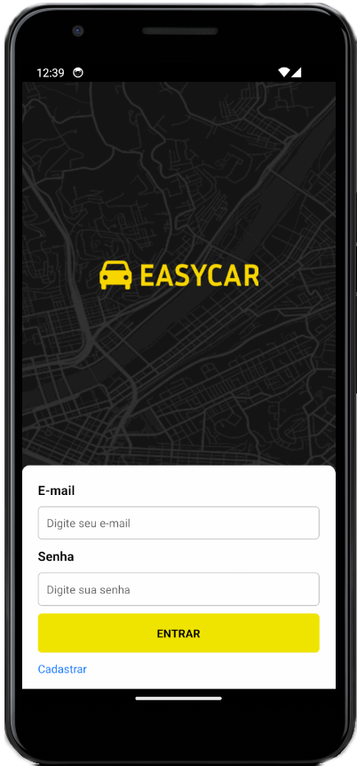

# Easy Car Mobile

## Descrição

Easy Car Mobile é uma aplicação de caronas que permite aos usuários solicitar e oferecer caronas de forma fácil e rápida. A aplicação foi desenvolvida utilizando diversas tecnologias modernas para garantir uma experiência de usuário fluida e eficiente.

## Tecnologias Utilizadas

- **React Native**: Framework para desenvolvimento de aplicações móveis multiplataforma.
- **React Navigation**: Biblioteca para navegação entre telas no React Native.
- **Axios**: Cliente HTTP para realizar requisições à API.
- **AsyncStorage**: Alternativa ao localStorage para armazenamento local de dados no React Native.
- **Context API**: Gerenciamento de estado global da aplicação.
- **Expo**: Plataforma para desenvolvimento, construção e implantação de aplicações React Native.
- **Google Maps**: Integração com mapas e geolocalização.

## Imagens




## Instalação

Para instalar e executar a aplicação localmente, siga os passos abaixo:

1. Clone o repositório:

   ```sh
   git clone https://github.com/seu-usuario/easy-car-mobile.git
   ```

2. Navegue até o diretório do projeto:

   ```sh
   cd easy-car-mobile
   ```

3. Instale as dependências:

   ```sh
   npm install
   ```

   ou

   ```sh
   yarn install
   ```

4. Inicie a aplicação:
   ```sh
   expo start
   ```

## Contribuição

Se você deseja contribuir com o projeto, por favor, siga os passos abaixo:

1. Fork o repositório.
2. Crie uma branch para sua feature ou correção de bug (`git checkout -b feature/nova-feature`).
3. Commit suas alterações (`git commit -m 'Adiciona nova feature'`).
4. Push para a branch (`git push origin feature/nova-feature`).
5. Abra um Pull Request.

## Licença

Este projeto está licenciado sob a licença MIT. Veja o arquivo LICENSE para mais detalhes.
